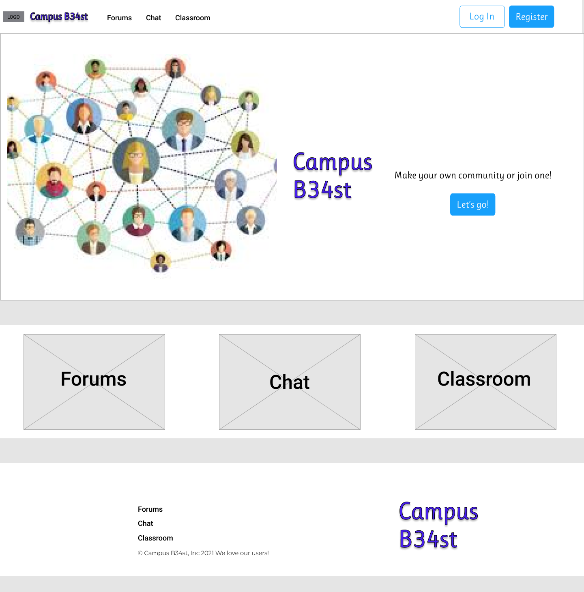
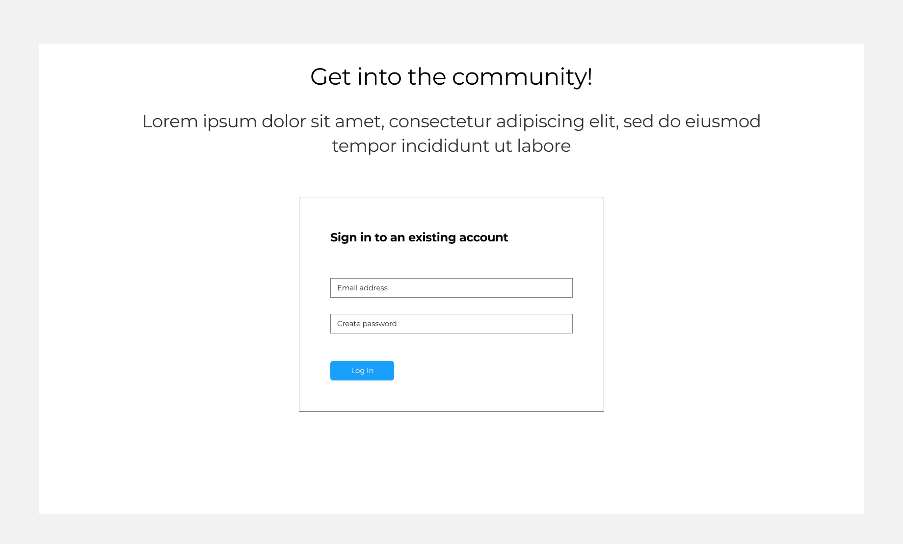
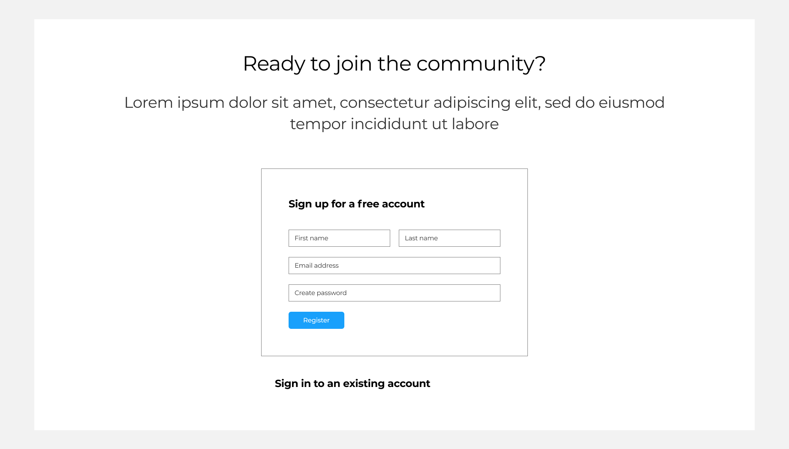
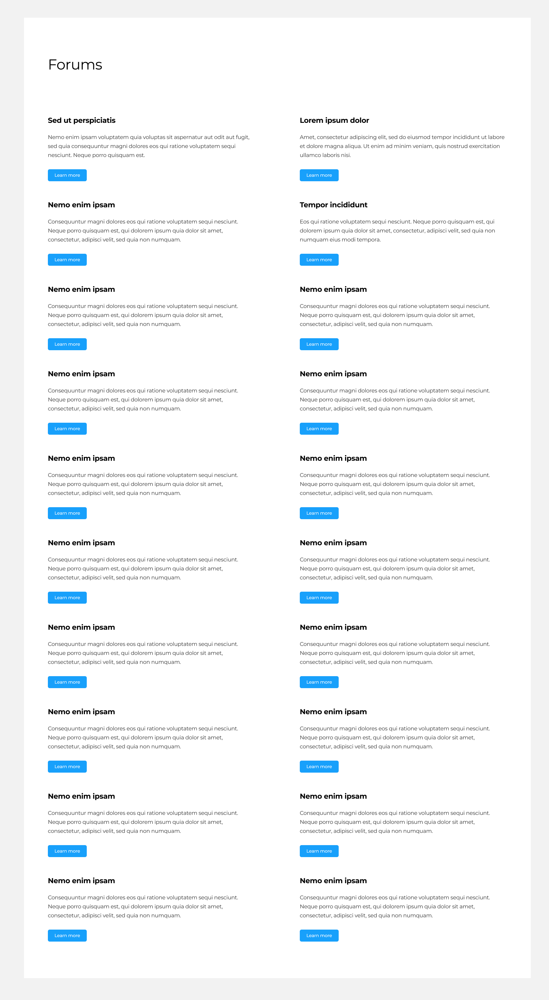
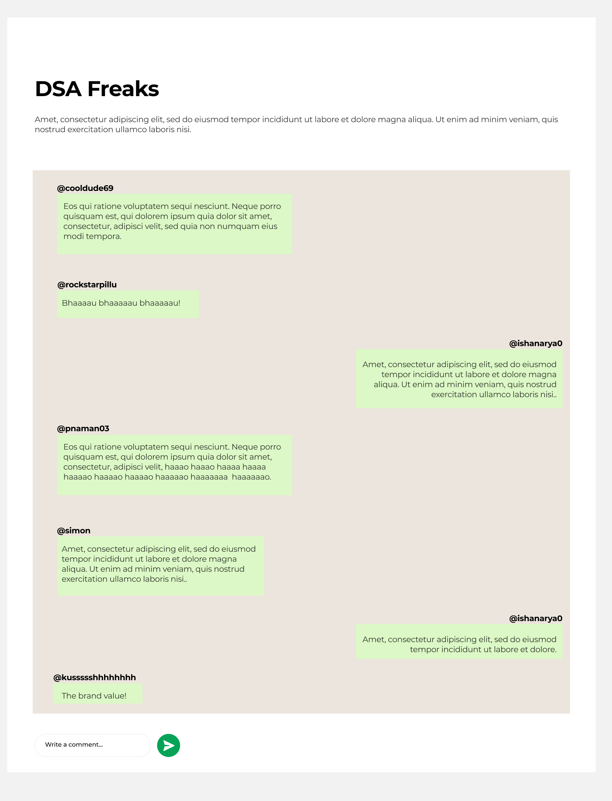

## Project Title- CampB34st A Social Network
**Category** Web Application
### Purpose
This is a social network site intended for the use of students and educators alike, which facilitate online learning and collaboration in a well structured way furthermore complementing offline education facilitating more interations thus better learning.

### Scope
It provides a platform for students and faculty to easily manage their classes and allows like minded students to collaborate like any other social media platform but one specifically designed for their need.

### Intoduction
Introduction contains follow sub categories

#### Existing Systems
#### Current Model
- Currently variety of learning management systems such as moodle exist facilitating the same
- Users are added to classrooms , where teachers can post their assignments evaluate them 
- It also has feature to embedd link to live classrooms, allowing students to deal with their classes in one platform only
#### Limitations in such models
- The following platform is built kept only limited forms of interactions in mind, namely student-classroom and student-faculty, for collaboration amongst students , formation of groups management of group activities is not supported natively by the platform.
- Furthermore learning is constrained between class or academic material, inability to have a social interaction on the app drops it's usage thus reducing the interaction in class for which LMS were primarily designed for.
#### Proposed System
- The proposed system is a union of both a social network and a LMS. It's functionalities include
    - **Registeration** of stakeholders, i.e students and faculty
    - **Forums** - This feature allows any user to create public or private discussion forum
    - **Posts** - Inside the form any user can add posts initiating the discussion on the forum
    - **My Classroom**- Incorporating the features of a LMS, faculty will have ability to create classroom for a specific group of students.
        - **Assignments**- Assignments can be added by faculty for students
        - **Result**- Marksheet of students can be displayed by faculty
    - **Chatting Service**- Any user can chat with any other user  

#### Advantages for students
- A single application for students to collaborate, have fun and study
- Provides students with the status of their current projects, assignments etc, without writing tedious mail to faculties or management.

#### Advantages for faculty
- Allowing them to manage their classes in a better structured manner without worrying regarding the administrative details
- Allowing them to form individual group with students for better focus on each individual.


### Functional Requirements

- User
  - Registration/Sign up Functionality
  - Create Forums
  - Users Shall be distinguishable by the **Type** of user i.e faculty or user
  - Faculty Specific
    - Select A group of students and add them to class
    - Upload CSV of Student Data, including roll Number Marks
  - Student Specific
    - All students must be distinguishable from group names
    - Student shall be added to classroom by the faculty
    
```javascript
    Content
    {
        common:{
            username: String,
            password: String,
            name: String,
            gender: String,
            collgName: String,
            email: String,
            isFaculty: Boolean,
            department: String,
            EnrolledDate: Date,
            createdPrivateForums:[{
                _id: Schema.Types.ObjectId,
                ref: 'Forums'
            }]
        },
        studentOnly:{
            rollNo: String,
            course: String,
            courseDuration: Number,
            classEnrolled:[{
                _id: Schema.Types.ObjectId,
                ref: 'Class'
            }],
            collegeGroup:[
                {
                    GroupName: String
                }
            ],
        },
        facultyOnly:{
            registrationNumber: String,
            classTeaching:[{
                _id: Schema.Types.ObjectId,
                ref: 'Class'
            }],
        }
    }, {timestamps : true}
```

- Chat
  - Users Should be able to commincate via web sockets
  - Each chat Model

```javascript
    //To and from is username denormalized
    {
        content: String,
        to: String,
        from: String
    }, {timestamps: true}
```

- Forum
  - Forum Name should be unique
  - Forums are of three types
    - Private - Created by specific user, each private forum supports upto 200 members
    - Public - Public forums are visible to all
    - Class- related forums, these are special forums that will be added to class  
    - Proposed Features
```javascript
    {
        common:{
            forumName: String,
            forumDescription: String,
            typeKey: ['Class', 'Private', 'Public'],
            creator:{
                //Creator of the forum
                _id: Schema.Type.ObjectId
            }
        },
        privateOnly:{
            members:[{
                //Id of each member
                _id: Schema.Types.ObjectId,
                ref: 'User'
            }]
        }
    }
```
- Posts
    - Users can add post and view them
    ```javascript
        {
            postHeading: String,
            postContent: String,
            createdBy:{
                _id: Schema.Types.ObjectID,
                ref: 'User'
            },
            parentForum:{
                _id: Schema.Types.ObjectId.
                ref: 'Forum'
            }
        }
    ```
### Non Functional Requirements
- Secure access to users data
- Low latency with chatting microservice, high availability
- Flexible architecture for future integrations 

### External Interface Requirements
### User Interfaces
- The UI Should be responsive across multiple viewports, to facilitate smooth cross browser and cross device design.
- UI should be static, i.e with minimal or no animation, (however transitions are allowed) for better performance.
- Proposed UI us as follows
    - **Home Page**
    
    - **Login**
    
    - **Signup**
    
    - **Forums**
    
    - **Chat**
    
### Software Tools
- **Database Server**- MongoDB 
- **Client**- Web Browser
- **Development Tools**- Visual Studio Code, GitHub
- **Framework**- React.js, Socket.io, Express.js
- **Programming Languages**- JavaScript
- **Environment**- Node.js
- **Version Control**- Git

### Deployment Tools
- **AWS** - Node.js server running on EC2 instance
- **Mongo Atlas**- For remote Database server

### Hardware Specification
- Any device capable to running a modern web browser preferably **Google Chrome**.
